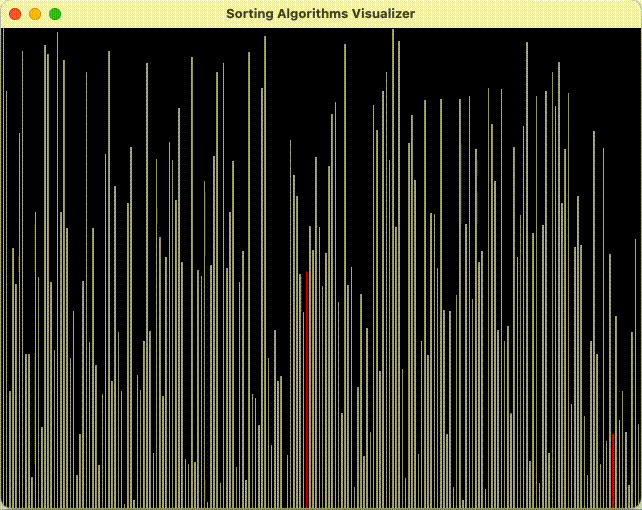

# Sorting Algorithms Visualization

  
Project build in C++ with OpenGL library used to visualize sorting process with algorithms:

- Bubble Sort: Time complexity $O(n^2)$, Space complexity $O(1)$
- Selection Sort: Time complexity $O(n^2)$, Space complexity $O(1)$
- Insertion Sort: Time complexity $O(n^2)$, Space complexity $O(1)$
- Merge Sort: Time complexity $O(nlog(n))$, Space complexity $O(n)$
- Quick Sort: Time complexity $O(nlog(n))$, Space complexity $O(log(n))$

In progress:

- Counting Sort
- Radix Sort
- Bucket Sort
- Heap Sort

Inspiration and reference:  
<https://www.youtube.com/watch?v=kPRA0W1kECg&ab_channel=TimoBingmann>  
<https://en.wikipedia.org/wiki/Sorting_algorithm>

# Observe the beauty of sorting!
Below there are gifs showing how algorithms listed above work in real time.

## Part 1: $O(n^2)$ Time complexity algorithms
### Bubble Sort - 50 elements
Number of comparision: 1225   
Number of swaps: 704   
<!--  -->

### Insertion Sort - 50 elements
Number of comparision: 749   
Number of swaps: 704   
<!--  -->

### Selection Sort - 50 elements
Number of comparision: 1275   
Number of swaps: 184   
<!--  -->

## Part 2: $O(nlog(n))$ Time complexity algorithms
### Merge Sort - 200 elements
Number of comparision: 2733   
Number of swaps: No swapping happening during merge sort      
Number of array accesses: 11079   
<!--  -->

### Quick Sort - 200 elements
Number of comparision: 1764   
Number of swaps: 705  
<!--  -->
 
 

### Heap Sort - 500 elements
Number of comparision: 2932   
Number of swaps: 1366  
<!--  -->
 
